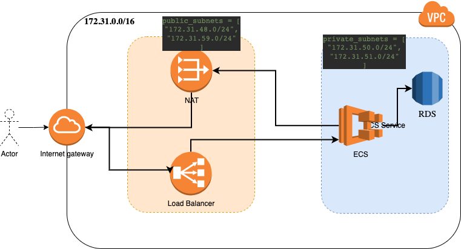

# climate-partner-testcode

## Run Infrastructure 
Required Terraform `">= 0.13.1"` and AWS Access credentials

First build the image in the flask dir and push it to the created ECR
Follow the instruction under `View Push Commands` in the ECR Repo


```bash
$ cd tf-notejam
$ export TF_VAR_access_key=ACCESS_KEY
$ export TF_VAR_secret_key=SECRET_KEY

terraform init

# TO apply
terraform apply

# To destroy
terraform destroy
```

The `tf-notejam` contains several modules for build the infrastructure for the ECS service with it's Tasks and and Autoscaling

## Modules
### 1- VPC

Here we create 4 subnets in multi zones for high-available load-balancing.


`  private_subnets = [
"172.31.50.0/24",
"172.31.51.0/24"
] --
public_subnets = [
"172.31.48.0/24",
"172.31.59.0/24"
]`

NAT gateway, some routing tables and finally aws cloudwatch log groups


### 2- Security Groups
Two security groups for the loadblancer and the ECS service
Port `80` ingress and Egress

### 3- LoadBalancer

- Load balancer of type Application
- aws alb target group for port 80

### 4- ECR
ECR Repository to save the docker image

### 5- RDS
SQL Database with storage autoscaling from 10 to 20 and a random created password

### 5- ECS
- ECS Cluster
- Task definition with the notejam image
- ECS Service contains the task
- Auto-scaling based on cpu and memory usage from 1 to 4